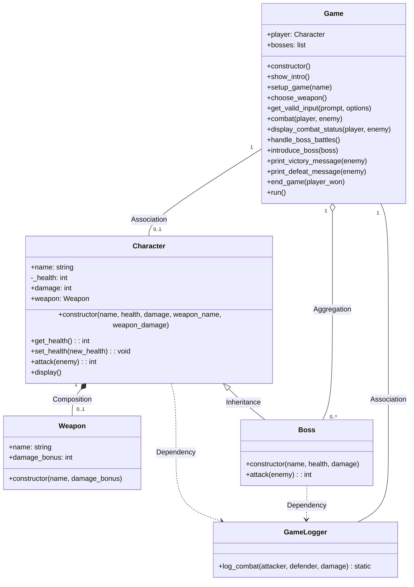

# UML Class Diagram Concepts in RPG Lesson

This document analyzes how `rpg_oop_concepts.py` demonstrates UML class diagram concepts and relationships.

## UML Class Diagram Concepts Covered

### 1. Classes and Objects
- The code defines multiple classes which would be represented as rectangles in a UML diagram
- Each class has attributes and operations, corresponding to the two compartments in a UML class box

### 2. Relationships

#### Explicitly Demonstrated Relationships

- **Inheritance (Generalization)**: Clearly demonstrated with `Boss` inheriting from `Character`, which would be shown with an empty arrowhead pointing from `Boss` to `Character`
  ```python
  class Boss(Character):
      def __init__(self, name, health, damage):
          super().__init__(name, health, damage, "Boss Weapon", 5)
  ```

- **Composition**: Explicitly mentioned in the comment for `Character` class where it creates and owns a `Weapon` instance
  ```python
  # Create the weapon inside the Character constructor (strong composition)
  self.weapon = Weapon(weapon_name, weapon_damage) if weapon_name else None
  ```
  This would be shown with a filled diamond on the Character side of the relationship. In composition, the lifetime of the contained object (Weapon) is managed by the container (Character).
  
  **Multiplicity**: Each Character has either 0 or 1 Weapon (0..1), and each Weapon belongs to exactly 1 Character (1).

#### Composition vs Dependency (Aggregation) for Character-Weapon

- **Composition** (black diamond):
  - The `Character` creates and owns its `Weapon` in the constructor.
  - The weapon is destroyed with the character and cannot exist independently.
  - Good for simple games with single, non-tradable weapons per character.

- **Dependency/Aggregation** (open diamond):
  - Weapons are created and managed independently of characters.
  - Characters are given references to existing weapon objects (which may be shared, swapped, or stored elsewhere).
  - Better for scalable RPGs with inventories, weapon trading, upgrades, or sharing.

**Example for scalable design:**
```python
class Character:
    def __init__(self, name, health, damage):
        self.name = name
        self._health = health  # Private attribute with getter/setter
        self.damage = damage
        self.weapon = None   # No weapon by default
        
    def get_health(self):
        return self._health
        
    def set_health(self, new_health):
        if new_health < 0:
            self._health = 0
        else:
            self._health = new_health

# Weapons are created separately and assigned
sword = Weapon("Sword", 15)
player = Character("Hero", 100, 10)
player.weapon = sword
```

**Summary Table:**
| Design      | Weapon Lifecycle         | Scalable? | Example Use Case           |
|-------------|-------------------------|-----------|---------------------------|
| Composition | Created/destroyed with Character | No        | Simple, single-weapon RPG |
| Dependency  | Managed independently    | Yes       | Inventories, trading, upgrades |

**Recommendation:**
For a scalable RPG, use dependency/aggregation: create weapons independently and assign them to characters as needed.

---

### Aggregation Relationship: Game and Boss

- **Aggregation** (open diamond ◇—) represents a “whole-part” relationship where the part (Boss) can exist independently of the whole (Game).
- In your code, the `Game` class manages or “has” multiple `Boss` objects, but those bosses are not destroyed if the game is destroyed—they could, in theory, be reused or managed elsewhere.

**Example from code:**
```python
class Game:
    def __init__(self):
        self.bosses = [Boss(...), Boss(...)]
```
- The `Game` object contains a list of `Boss` objects.
- The `Boss` objects are created (often inside `Game`), but aggregation means they could exist outside of `Game` or be reused.

**Multiplicity:**
- From Game to Boss: One game manages zero or more bosses (`1 — 0..*`).
- From Boss to Game: Each boss is typically associated with one game at a time.

**UML Notation:**
```
Game ◇——— 0..* Boss
  1
```
- Open diamond at the `Game` end, line to `Boss`.
- `1` near `Game`, `0..*` near `Boss`.

**Summary Table:**
| Relationship | UML Symbol   | Multiplicity | Meaning                                 |
|--------------|-------------|--------------|-----------------------------------------|
| Aggregation  | ◇———        | 1 — 0..*     | One game manages many bosses            |

This accurately models the flexible, non-owning relationship between `Game` and `Boss` in your project.

---

### Aggregation in Typical RPGs

In a well-designed, scalable RPG, most class relationships are aggregation rather than composition. This is because:
- **Objects can exist independently:** Weapons, items, quests, and characters can exist and be managed separately from each other.
- **Flexible ownership and sharing:** Aggregation allows items to be swapped, traded, stored in inventories, or assigned to different characters or locations.
- **Lifecycles are not tightly coupled:** Destroying a character does not necessarily destroy their items, and ending a quest does not destroy the player.

**When is composition used?**
- Use composition for strong “owns-a” relationships where the part cannot exist without the whole (e.g., a `HealthBar` UI element tied to a character).

**Typical RPG Relationships:**
| Relationship         | Example                  | Typical UML   |
|----------------------|-------------------------|---------------|
| Aggregation          | Character–Weapon        | ◇—            |
| Aggregation          | Inventory–Item          | ◇—            |
| Aggregation          | Game–Quest              | ◇—            |
| Aggregation          | Party–Character         | ◇—            |
| Composition (rare)   | Character–HealthBar     | ◆—            |
| Dependency           | Logger–Game             | dashed arrow  |

**Summary:**
- Most relationships in a scalable RPG are aggregation, because objects are reusable, shareable, and not tightly bound to one owner.
- Composition is used for rare cases where you want to enforce a strong ownership and lifecycle dependency.

- **Association between Game and GameLogger**: The `Game` class now creates and manages a `GameLogger` instance:
  ```python
  class Game:
      def __init__(self):
          self.player = None
          self.bosses = []
          # Create and manage a GameLogger instance (association)
          self.logger = GameLogger()
  ```
  This is represented with a solid line in UML. The association shows that `Game` has a reference to a `GameLogger` instance and manages its lifecycle.
  
  **Multiplicity**: Each Game has exactly 1 logger (1), and each logger is associated with exactly 1 Game (1).

#### Benefits of Association vs. Static Methods for GameLogger

The refactoring from static methods to an association relationship between `Game` and `GameLogger` demonstrates several important OOP principles and design benefits:

**1. Before (Static Methods):**
```python
class GameLogger:
    @staticmethod
    def log_combat(attacker, defender, damage):
        timestamp = datetime.datetime.now().strftime("%H:%M:%S")
        print(f"[{timestamp}] COMBAT LOG: {attacker.name} attacked {defender.name} for {damage} damage")

# Usage in Character
def attack(self, enemy):
    # ...
    GameLogger.log_combat(self, enemy, total_damage)
```

**2. After (Association):**
```python
class GameLogger:
    def __init__(self, log_to_console=True):
        self.log_to_console = log_to_console
        
    def log_combat(self, attacker, defender, damage):
        timestamp = datetime.datetime.now().strftime("%H:%M:%S")
        log_message = f"[{timestamp}] COMBAT LOG: {attacker.name} attacked {defender.name} for {damage} damage"
        if self.log_to_console:
            print(log_message)

class Game:
    def __init__(self):
        # ...
        self.logger = GameLogger()

# Usage in Character
def attack(self, enemy, logger=None):
    # ...
    if logger:
        logger.log_combat(self, enemy, total_damage)
```

**Key Benefits:**

1. **Configurability**: The logger can be configured differently for each game instance (e.g., enable/disable console logging, set verbosity levels).

2. **Extensibility**: The logger can be extended to support multiple output destinations (console, file, network) without changing character code.

3. **Testability**: During testing, a mock logger can be injected to verify logging behavior or suppress output.

4. **Dependency Injection**: The `Game` class now injects the logger into character methods, following the dependency injection pattern.

5. **Single Responsibility**: Each class has a clearer responsibility—`Game` manages the logger, `Character` uses it when needed.

6. **Future-Proofing**: The design supports future enhancements like:
   - Logging to files
   - Different log levels (debug, info, warning)
   - Log filtering
   - Analytics based on combat logs

This change demonstrates how proper UML relationships translate to better code design and maintainability.

- **Dependency between Character/Boss and GameLogger**: Characters and bosses now use the logger passed to them by the Game:
  ```python
  def attack(self, enemy, logger=None):
      # ...
      if logger:
          logger.log_combat(self, enemy, total_damage)
  ```
  This is represented with a dashed arrow in UML. A dependency indicates that one class uses another class, but doesn't store a reference to it.

#### Implicit Relationships in the Code

- **Association**: The `Game` class has an association with `Character` and `Boss` through its attributes:
  ```python
  def __init__(self):
      self.player = None  # Association with Character
      self.bosses = []    # Association with Boss
  ```
  This would be shown with a solid line between classes. Association represents a "uses-a" relationship where one class references another.
  
  **Multiplicity**: Each Game has exactly 1 player Character (1), and each Character can be part of at most 1 Game (0..1).

- **Aggregation**: The relationship between `Game` and `bosses` could be considered aggregation:
  ```python
  def setup_game(self, name):
      # ...
      self.bosses = [Boss("Goblin King", 50, 8), Boss("Dark Sorcerer", 60, 9)]
  ```
  This would be shown with a hollow diamond on the Game side. Unlike composition, in aggregation the contained objects (bosses) can exist independently of the container (Game).
  
  **Multiplicity**: Each Game contains many Boss instances (0..*), and each Boss belongs to exactly 1 Game (1).

### 3. Class Members
- **Attributes**: Shown in each class's `__init__` method (e.g., `name`, `health`, `damage` in `Character`)
- **Methods**: Each class defines methods that would appear in the operations compartment of a UML class

### 4. Visibility
- The code demonstrates visibility through Python's convention of using underscore prefixes for private members
- The `Character` class has a private `_health` attribute with public getter and setter methods
- Private members would be denoted by `-` in UML, while public members use `+`
- Example from the code:
  ```python
  class Character:
      def __init__(self, name, health, damage, weapon_name=None, weapon_damage=0):
          self.name = name  # public attribute
          self._health = health  # private attribute
          # ...
      
      # public methods to access private attribute
      def get_health(self):
          return self._health
      
      def set_health(self, new_health):
          if new_health < 0:
              self._health = 0
          else:
              self._health = new_health
  ```

### 5. Static Members
- The `@staticmethod` decorator on `GameLogger.log_combat()` represents a static method, which would be underlined in UML

## UML Concepts Not Explicitly Covered

1. **Interface**: No explicit interfaces are defined (would use dashed lines in UML)
2. **Abstract Classes**: No abstract classes are defined

## UML Class Diagram

### Text-Based Diagram

```
                         ┌───────────────┐
                         │  GameLogger   │
                         └───────────────┘
                                 │
                                 │ «association»
                                 │
┌───────────┐ «composition» ┌───────────────┐
│  Weapon   │◆───────────── │   Character   │
└───────────┘               └───────────────┘
                                 ▲            ▲
                                 │            │
                                 │            │ «association»
                                 │ «inheritance» │
                                 │            │
                           ┌───────────┐      │
                           │   Boss    │      │
                           └───────────┘      │
                                 ▲            │
                                 │               │
                                 │ «aggregation» │
                                 ◇              │
                           ┌───────────┐         │
                           │   Game    │─────────┘
                           └───────────┘
```

Legend:
- ◆ : Composition (filled diamond)
- ◇ : Aggregation (hollow diamond)
- ▲ : Inheritance/Dependency (direction of arrow)
- ─ : Association (simple line)

### Mermaid Diagram



The Mermaid diagram shows:
- Classes with their attributes and methods
- Visibility modifiers: `+` for public members, `-` for private members
- Inheritance relationship between Boss and Character
- Composition between Character and Weapon (1 Character has 0..1 Weapon)
- Dependency relationships with GameLogger
- Aggregation between Game and Boss (1 Game has 0..* Boss instances)
- Association between Game and Character (1 Game has 0..1 Character)

**Note on Notation:**
- `constructor` represents the Python `__init__` method that initializes new objects
- In Python, this is written as `def __init__(self, parameters)`, but UML diagrams often use more generic terminology
- The visibility symbols show which members are accessible from outside the class:
  - `+` public: can be accessed from anywhere
  - `-` private: should only be accessed from within the class

**Multiplicity Notation:**
The numbers represent how many instances of each class participate in the relationship. For example:
- "1" -- "0..1" means one instance on the left side relates to zero or one instance on the right side
- "1" -- "0..*" means one instance on the left side relates to zero or many instances on the right side

## Teaching Notes

When teaching UML with this code example:

1. **Start with Classes**: Begin by identifying the classes and their attributes/methods
2. **Identify Relationships**: Show how classes relate to each other (inheritance, composition, dependency)
3. **Draw the Diagram**: Create a visual representation of the classes and their relationships
4. **Connect to Code**: Show how each UML element maps to specific code constructs
5. **Discuss Missing Concepts**: Use the "not explicitly covered" section to discuss other UML concepts

This code provides an excellent foundation for teaching UML class diagrams, as it includes explicit comments referencing UML concepts and demonstrates several key relationship types.
