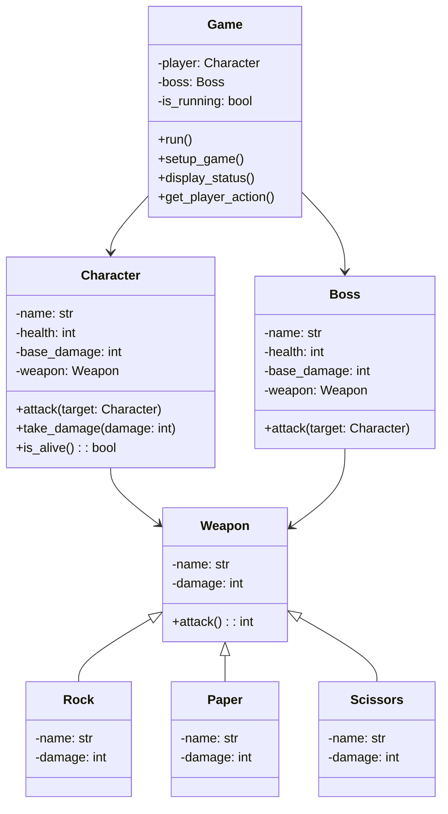

# RPG Game UML Class Diagram

```mermaid
classDiagram
    class Game {
        +run()
        +setup_game()
        +display_status()
        +get_player_action()
        -player: Character
        -boss: Boss
        -is_running: bool
    }

    class Character {
        +attack(target: Character)
        +take_damage(damage: int)
        +is_alive(): bool
        -name: str
        -health: int
        -base_damage: int
        -weapon: Weapon
    }

    class Boss {
        +attack(target: Character)
        -name: str
        -health: int
        -base_damage: int
        -weapon: Weapon
    }

    class Weapon {
        +attack(): int
        -name: str
        -damage: int
    }

    class Rock {
        -name: str
        -damage: int
    }

    class Paper {
        -name: str
        -damage: int
    }

    class Scissors {
        -name: str
        -damage: int
    }

    Game --> Character
    Game --> Boss
    Character --> Weapon
    Boss --> Weapon
    Weapon <|-- Rock
    Weapon <|-- Paper
    Weapon <|-- Scissors
```
